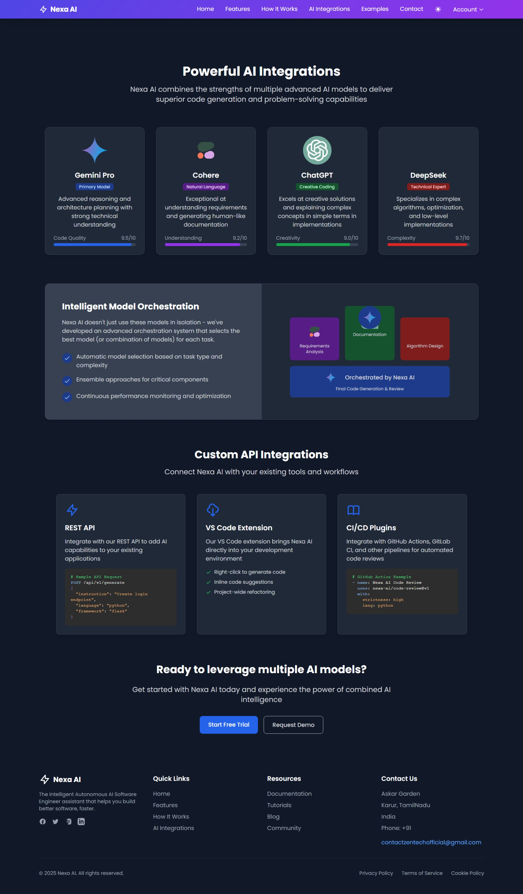

# Nexa-AI — Autonomous AI Software Engineer

> **Describe your idea in plain English. Get a complete software project — auto-generated.**  
> Architecture, code, tests, documentation, and deployment setup — all created autonomously by AI.





---

## Table of Contents

- [About](#-about)
- [How It Works](#-how-it-works)
- [Why Choose Nexa-AI?](#-why-choose-nexa-ai)
- [AI Integrations](#-ai-integrations)
- [Example Projects](#-example-projects)
- [Installation](#-installation)
- [Usage](#-usage)
- [Tech Stack](#-tech-stack)
- [Author](#-author)

---

## ℹAbout

**Nexa-AI** is an autonomous AI developer that transforms high-level natural language instructions into full-stack software projects. Built as a **web-based interface**, it leverages multiple AI models to plan, code, test, and document your application — all in one click.

Ideal for rapid prototyping, MVP development, or learning modern tech stacks.

---

## How It Works

1. **Describe Your Project**  
   Enter a simple prompt like: _"Build a blog with user login and Markdown support."_

2. **AI Planning**  
   Nexa-AI selects the best architecture and tools (e.g., Flask + SQLite + Tailwind).

3. **Autonomous Code Generation**  
   AI writes backend logic (Python), frontend templates (HTML + Jinja), and basic interactivity (JavaScript).

4. **Output Delivery**  
   Download a complete, organized project folder — ready to run or extend.

---

## Why Choose Nexa-AI?

- **End-to-End Automation**: From idea → working project in minutes  
- **Multi-AI Collaboration**: Best model for planning, coding, and refinement  
- **Production-Ready Structure**: Modular, documented, and tested  
- **Zero Setup for Users**: Entirely browser-based — no CLI needed

---

## AI Integrations

Nexa-AI uses a smart routing system to assign tasks to the most capable model:

| Model | Role |
|------|------|
| **Gemini Pro** | System design & technical planning |
| **Cohere** | Understanding natural language requirements |
| **ChatGPT** | Code generation & documentation |
| **OpenRouter (DeepSeek)** | Complex logic & edge-case handling |

> API keys are configured server-side (see `.env`).

---

## Example Projects

| Your Prompt | Generated Output |
|-----------|------------------|
| _"Create a task manager with login"_ | Flask app with user auth, SQLite, responsive HTML/Jinja templates |
| _"Build a weather dashboard"_ | HTML frontend with JS API calls, Python backend for data caching |
| _"Make a REST-like API for notes"_ | Flask routes, JSON responses, simple CRUD logic |
| _"Generate a portfolio website"_ | Static HTML + Tailwind + Jinja, with contact form backend |

---

## Installation

### Prerequisites
- Python 3.9+
- `pip`
- `git`

### Setup

```bash
# Clone the repository
git clone https://github.com/ARIHARAN-KC/nexa-ai.git
cd nexa-ai

# Create virtual environment (recommended)
python -m venv venv
source venv/bin/activate  # Linux/macOS
# venv\Scripts\activate  # Windows

# Install dependencies
pip install -r requirements.txt
```

> Copy `.env.example` to `.env` and add your AI provider API keys.

---

## Usage

Start the web server:

```bash
python app.py
```

Open your browser:  
[http://localhost:5000](http://localhost:5000)

Enter your project idea, click **"Generate"**, and download your complete software project!

---

## Tech Stack

Based on actual codebase composition:

- **HTML**  
- **Python Flask**  
- **Jinja**   
- **JavaScript**   

**Framework**: Lightweight Python web framework (e.g., Flask)  
**Styling**: Tailwind CSS  
**Templating**: Jinja2  
**Deployment**: Ready for local or cloud (Render, Railway, etc.)

---

## Author

**Ariharan K.C.**  
ariharankc@gmail.com
[GitHub](https://github.com/ARIHARAN-KC)  
[LinkedIn](https://www.linkedin.com/in/ariharankc07/)
[Portfolifo](https://ariharan-portfolifo.vercel.app/)

---

## License

Distributed under the **MIT License**. See [LICENSE](LICENSE) for details.

---

> **The future of software development is autonomous. Start building smarter — not harder.**

---
